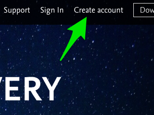
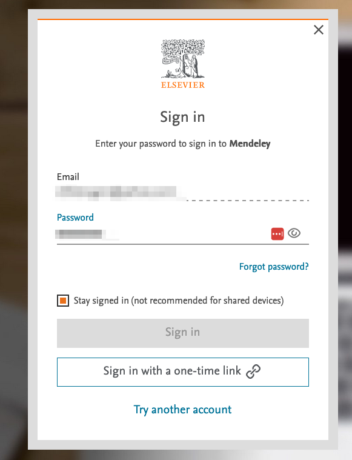
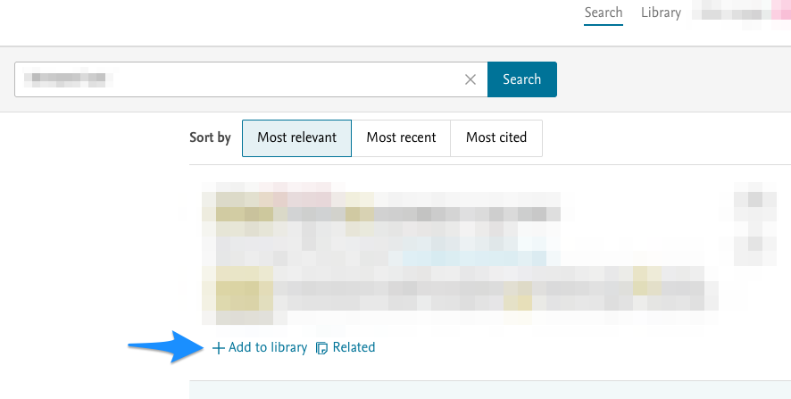
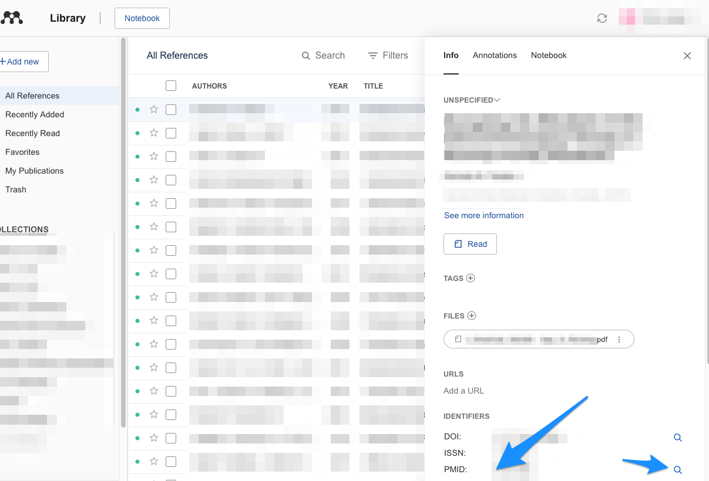

# Mendeleyn käyttö

\

\

Mendeleytä pystyy periaatteessa käyttämään täysin web-selaimen kanssa,
ilman erillistä desktop-sovelluksen asennusta. Tämä voi olla joskus
ainoa mahdollinen metodi, jos esim. työpaikan koneelle ei ole lupaa
asentaa desktop-sovelluksia.

\

Alla nopea ohje, jolla pääsee Mendeleyn web-version käytössä alkuun.

\

\

------------------------------------------------------------------------

\

\

-   Googleta "mendeley" tai klikkaa alla näkyvään linkkiin:

\

[\<https://www.mendeley.com\>](https://www.mendeley.com/)

\

\

\

\

-   Klikkaa "Sign In", jos sinulla on jo Mendeleyn käyttäjätunnus; jos
    ei vielä ole, luo sellainen klikkaamalla "Create account":

\

\

\

\

\

\

\

-   Joissakin tilanteissa, joissa olen yrittänyt sisäänkirjautua
    kohdasta "Sign In", on pitänyt olla VPN-yhteys muodostettuna
    yliopistoon ja on pitänyt valita kohta "Sign in via your
    institution", jotta pääsee eteenpäin. Välillä taas näin ei ole
    tarvinnut tehdä.

\

-   Kun pääset kyseisestä kohdasta eteenpäin, joudut vielä vastaamaan
    tahdotko pysyä sisäänkirjautuneena (ks. kuva alla), vastaa tähän
    toiveesi mukaisesti.

\

-   Saattaa olla, että kohta "Sign in" on harmaana, jolloin joudut
    sisäänkirjautumaan kohdasta "Sign in with a one-time link" - jos
    näin on, sisäänkirjautumiseen vaadittu linkki lähetetään
    sähköpostiisi:

\

\

\

\

\

\

\

-   Kun onnistut sisäänkirjautumaan, tarjoutuu erilaisia vaihtoehtoja.
    Voit ladata tästä näkymästä itsellesi Mendeleyn desktop-softan, jos
    olet kiinnostunut käyttämään sitä. Tämän oppaan tarkoitus on
    kuitenkin esitellä Mendeleyn web-version käyttöä, joten esitellään
    kohtien "Search" ja "Library" käyttö:

\

\

\

\

\

\

-   Klikkaa kohtaan "Search" ja etsi jokin artikkeli (alla hakutulos
    sumennettu). Kun klikkaa kohtaan "Add to library", haettu artikkeli
    on lisätty Mendeleyn henk.koht. kirjastoosi:

\

\

\

\

\

\

-   Kys. klikkauksen jälkeen kys. teksti muuttuu muotoon "View in
    library", voit klikata siihen:

\

\

\

\

\

\

\

-   Kys. klikkaus siirtää sinut kirjastosi puolelle. Äsken lisätty
    artikkeli saattaa näkyä artikkelikokoelmassasi (alla sumennettuna)
    ylimpänä:

\

\

\

\

\

-   Yksi kätevimmistä toiminnoista Mendeleyssä on seuraava. Voit raahata
    esim. PubMedin kautta löytämäsi ja lataamasi artikkeli-pdf:n suoraan
    kirjastosi päälle ja tiputtaa sen siihen, jolloin se lisätään
    automaattisesti kirjastoosi:

\

\

\

\

\

-   Onnistuneen lisäyksen tuloksena näet oikeassa alalaidassa tämän
    jälkeen seuraavan tekstin:

\

\

\

\

\

\

-   Uskomattominta on, että suurimmassa osassa tapauksista Mendeley on
    automaattisesti täydentänyt artikkelin oikeat tiedot (nimen,
    kirjoittajat jne.) kirjastoon. Toki ne on hyvä käydä varmistassa
    klikkaamalla kys. kirjastoon tuotuun artikkeliin. Tuolloin avautuu
    seuraava näkymä. Jos tiedot ovat pielessä, oma metodini on
    kirjoittaa PubMedistä haettu ID-koodi ja painaa suurennuslasia,
    jolloin tiedot korjaantuvat oikeiksi:

\

\

\

\

\

\

\

Mendeleyn kaikkein keskeisimmät toiminnot on nyt yllä esitelty. Seuraavassa luvussa opetellaan, miten saa tuotua tuotua Mendeleyn henk.koht. kirjastosta viitteitä
Word-käsikirjoitukseen.

\

\
