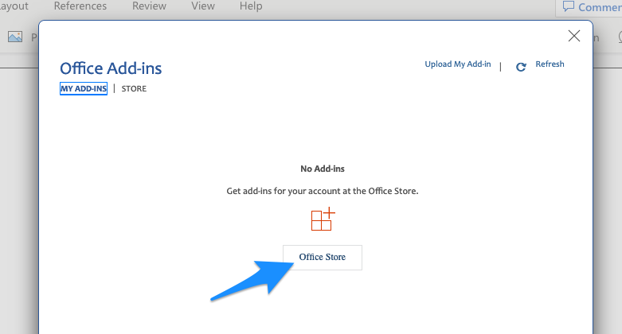
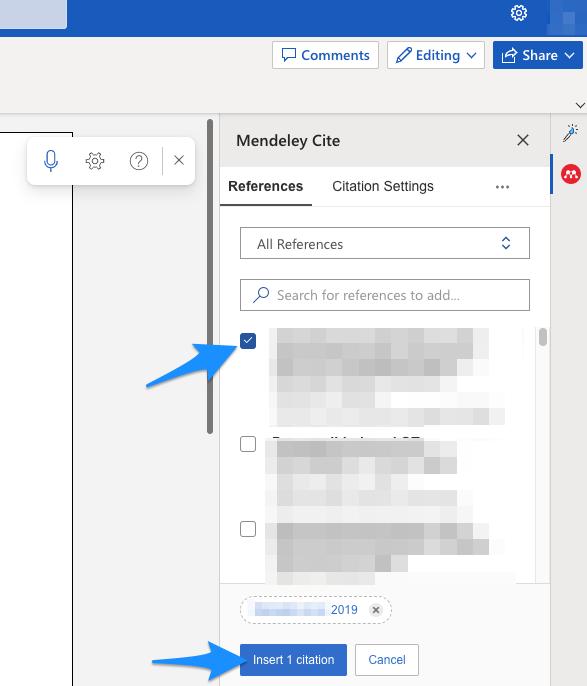

# Wordiin viitteet

\

\

\

Esittelen seuraavassa metodin, jolla saat tuotua viitteitä Mendeleyn
henk.koht. kirjastostasi MS Wordin web-versioon.

\

\

\

-   Googleta "microsoft 365: login" tai paina alla olevaa linkkiä:

\

[www.office.com](http://www.office.com)

\

\

-   Tarvitset Officeen tilin itsellesi, jos sinulle ei sellaista ole ja
    tahdot jatkaa tämän metodin opiskelua, sinun pitää luoda itsellesi
    kys. tili. Tämän jälkeen pääset yo. linkistä sisäänkirjautumaan MS
    Officen web-pohjaisiin toimintoihin.

\

-   Kun olet päässyt sisäänkirjautumaan yo. linkistä, avautuu seuraava
    näkymä. Klikkaa joko Wordin ikoniin tai suoraan Word-dokumentin
    luonti-ikoniin:

\

\

\

\

\

\

\

\

-   Jotta saat Mendeleyn käyttöösi, sinun pitää lisätä itsellesi
    Mendeleyn "Add-in" käyttöön. 

\

-   Klikkaa Wordin valikosta kohtaan "Insert":

\

\

\

\

\

\

\

-   Tämän jälkeen kolmeen pisteeseen:

\

\

\

\

\

-   Sieltä kohtaan "Add-ins":

\

\

\

\

\

\

-   Sieltä kohtaan "Office Store":

\

\

\

\

\

-   Kirjoita hakukenttään "Mendeley" ja paina suurennuslasia, klikkaa
    sitten Mendeley Cite -add-inin vierestä painikkeeseen "Add":

\

\

\

\

\

\

-   Jos kys. add-inin tahtoo asentaa, täytyy hyväksyä esitellyt ehdot
    painamalla "Continue":

\

\

\

\

\

\

\

-   Onnistuneen latauksen tuloksena näet seuraavan näkymän ruudun
    oikealla laidalla ja voit painaa "Get started". Huom! Sain itse
    tämän Mendeleyn add-inin toimimaan Chrome-selaimessa, mutta en
    Firefoxilla. Myös Chrome saattaa siten olla hankala, että pyytääkin
    "Institution"-sisäänkirjausta, mutta siitäkin pääsee ohi, kun avaa
    Chromen toisessa ikkunassa/tabissa Mendeleyn ja sisäänkirjautuu,
    tällöin myös Wordin web-versiossa Mendeleyn add-in ymmärtää, että
    käyttäjä on jo sisäänkirjautunut:

\

\

\

\

-   Jos kaikki meni ok, näkyy nyt oikeassa laidassa kirjastosi (tässä
    sumennettuna):

\

\

\

\

\

-   Nyt jatkossakin Wordin valikosta kohdasta "References" löytyy
    Mendeley Cite -add-in. Voit kirjoittaa jotakin tekstiä ja kokeilla
    toimivuutta viemällä kursorin kohtaan, johon tahtoisit tekstin
    sisäisen viitteen:

\

\

\

\

\

 

\

-   Valitse tämän jälkeen oikeassa marginaalissa haluamasi artikkeli
    kirjastostasi ja paina "Insert 1 citation" (voit myös valita useita
    viitteitä samalla kertaa):

\

\

\

\

\

\

-   Tämän jälkeen tekstin sisäinen viitteesi on siirtynyt paikalleen:

\

\

\

\

-   Voit halutessasi lisätä lähdeluettelon tekstin loppuun. Vie kursori
    haluamaasi kohtaan (todnäk. tekstin lopussa):

\

\

\

\

\

\

\

\

\

-   Oikeassa marginaalissa klikkaa kolmeen pisteeseen ja edelleen
    kohtaan "Insert Bibliography":

\

\

\

\

\

\

\

-   Hyväksy lähdeluettelon lisäys painamalla "Continue":

\

\

\

\

\

-   Nyt näet tekstiosiosi puolella lähdeluettelon:

\

\

\

\

\

\

Yllä on kuvattu lyhyesti, miten Wordin web-versiossa saat lisättyä
viitteitä Mendeleyn henk.koht. kirjastostasi. Mendeleyn desktop-version
ja samaten Wordin desktop-version käyttö on toki useimmiten
suoraviivaisempaa, mutta esim. työkoneella yllä kuvattu tapa saattaa
olla ainoa käytettävissä oleva.

\

Pidemmän päälle on suositeltavaa asentaa tietokoneelle Mendeleyn desktop-sovellus ja käyttää sitä yhdessä tietokoneelle asennetun MS Wordin desktop-sovelluksen kanssa. Tämä käyttötapa esitellään seuraavassa luvussa.
