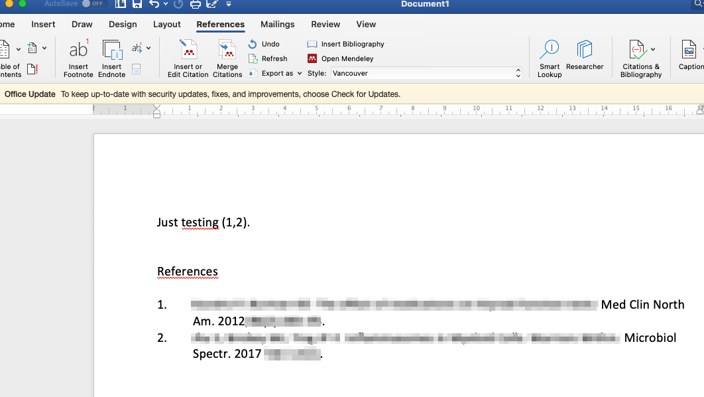

# Desktop-softat

\

Edellisissä luvuissa käsiteltiin viitteidenhallintaa web-selaimella
toteuttaen, ilman siis tarvetta sille, että olisi varsinaisesti
asennettuna tietokoneelle viitteidenhallintasovellus Mendeley Desktopia
tai MS Wordia.

Pidemmän päälle sekä MS Word että Mendeley kannattaa kuitenkin asentaa
varsinaisina ns. desktop-sovelluksina. Näiden kahden softan yhteiskäyttö
on pitkälti samanlaista niin desktop-sovelluksina kuin web-selaimella
toteutettuna, mutta mielestäni desktop-sovellusten kautta käyttö on
paljon nopeampaa ja jouhevampaa.

Esittelen seuraavassa, miten Mendeleyn desktop-sovellus asennetaan, ja
miten siitä edelleen saa asennettua lisäosan (*add-in*) MS Wordin
desktop-sovellukseen (eli varsinaisesti tietokoneeseen asennettuun MS
Wordiin). Kyseinen Mendeleyn lisäosa mahdollistaa viitteiden tuonnin
Mendeleyn kirjastosta MS Wordissa työstettävään käsikirjoitukseen.

\

\

## Mendeleyn asennus

Edellä luvussa "Mendeleyn käyttö" jo esiteltiinkin, miten Mendeleyn
desktop-sovelluksen saa koneelleen ladattua asennusta varten. Vielä
kertauksena: kun onnistut sisäänkirjautumaan Mendeleyhin, keskelle
ruutua tarjoutuu linkki, josta latauksen voi tehdä. Ks. kuva alla:

\

\

\

## Lisäosa Wordiin

Kun olet asentanut Mendeleyn desktop-sovelluksen tietokoneellesi, ja kun
tietokoneessasi niin ikään on myös MS Wordin varsinainen
desktop-sovellus asennettuna, voit asentaa Mendeleyn lisäosan *(add-in)*
MS Wordiin. Huom! Lisäosan asennuksen aikana MS Wordin pitää olla
kokonaan suljettuna.

Asennus on helppoa - klikkaa Mendeley Desktop -sovelluksessa
"Tools"-ylävalikosta "Install MS Word Plugin":

\

\

\

Onnistuneen asennuksen osoituksena näet ikkunan jonka otsikkona on
"Plugin Installed":

\

\

\

## Lisäosan bugi

Olen huomannut - ja kuullut muiltakin käyttäjiltä -, että ainakin
Macintoshin MS Wordissa Mendeleyn lisäosa aina välillä heittää herjan
*(nag)*, joka valittaa tyyliin:*"...you have not actioned this in
Mendeley Desktop..."*

Herja tulee toisinaan näkyviin mutta ei varsinaisesti estä lisäosan
käyttöä. En ole googlettamalla tai keskustelufoorumeilta löytänyt
toimivaa ratkaisua tämän herjan poistamiseksi. Lisäosan poistaminen
*(uninstallation)* ja uudelleen asentaminen onnistuu helposti Mendeley
Desktop -sovelluksen ylävalikon "Tools" alta, mutta tämä ei poista
herjan esiintymistä.

Mendeleyn lisäosaa pystyy Wordissa käyttämään herjasta huolimatta. Kun
herjan on kuitannut pois, voi viitteen hakea uudelleen. Herjan saa
kuitattua pois painamalla "Cancel":

\

\

\

## Lisäosan käyttö

Mendeleyn lisäosan käyttö Wordissa vastaa aivan samaa workflow'ta kuin
edellä jo esiteltiin kappaleessa "Wordiin viitteet". Mendeleyn lisäosan
toiminnot löytyvät Wordin *"Ribbonista"*, kohdasta *"References"*.
Mendeleyn lisäosan keskeisimmät kolme toimintoa ja niiden painikkeet on
nuolin ja numeroin osoitettuina seuraavassa kuvassa:

\

\

### Viitteiden lisäys

\
Käytännössä käyttäjä yleensä:

1.  Lisää tekstin sisäisiä viitteitä (painike 1 yllä)

2.  Valitsee haluamansa viittaustyylin (painike 2 yllä)

3.  Lisää käsikirjoituksen loppuun lähdeluettelon (painike 3 yllä)

    -   Huom. Lähdeluettelon otsikko (esim. *"References"* täytyy MS
        Wordilla itse kirjoittaa)

Lopputulos voisi näyttää seuraavalta (tyyli *"Vancouver"* valittuna):

\

